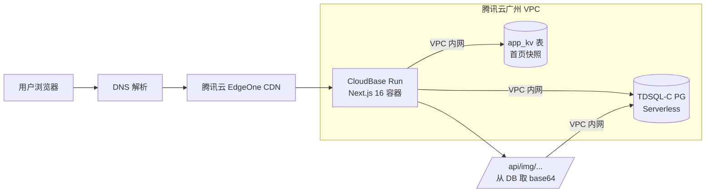

# Neon → 腾讯云 整站迁移：操作手册 + 进度看板（迁移**前**计划）

> 本文档是迁移**前**的计划与进度看板。
>
> **如果你想看迁移完成后实际怎么走的、踩了哪些坑、怎么修，请直接看 [`docs/migration-tencent-postmortem.md`](./migration-tencent-postmortem.md)。**
>
> 本文档保留下来作为**计划阶段**的留档；事后总结见 postmortem。

---

## 一、最终决策

| 维度 | 旧 | 新 |
|---|---|---|
| 数据库 | Neon PostgreSQL（serverless，AWS ap-southeast-1） | **腾讯云 云数据库 PostgreSQL 16**（TencentDB for PostgreSQL，广州 / 上海，**单机版**或双机版）|
| 应用 | Vercel（Singapore） | **CloudBase Run（容器托管）**，与 DB 同地域 |
| 数据库连接 | Neon HTTPS 驱动（`@neondatabase/serverless`） | 原生 `postgres` TCP 包（保留 `lib/neon/sql.ts` 路径不动） |
| 国内访问 | `*.vercel.app` 被部分运营商干扰 | 自有域名 + ICP 备案 |
| 跨境延迟 | Vercel SG → Neon SG：~30ms（同区） | CloudBase Run → 云数据库：**VPC 内网 < 3ms** |
| 月成本 | Neon 免费档 + Vercel 免费档 | PG 单机版 ~¥80 + CloudBase Run ¥30–60 ≈ **¥110–140 / 月** |

> **重要更正（2026-05-06 12:00）**：原计划写的「TDSQL-C PostgreSQL Serverless」**在腾讯云不存在** —— Serverless 形态目前只有 MySQL 版有。PG 这条线只有「云数据库 PostgreSQL」（标准托管）和「TDSQL-C PostgreSQL」（云原生集群，2 实例起步贵 1 倍）。本项目流量小，选**云数据库 PostgreSQL 单机版**性价比最高。

**为什么不选 CloudBase 数据库（MySQL / PostgREST / MongoDB）**：要么不兼容关系模型，要么需要重写 100 处 SQL 模板（[lib/neon/data.ts](../lib/neon/data.ts)）+ 5 个 plpgsql 函数。**云数据库 PostgreSQL** 是腾讯云体系内**与 Neon 行为最接近**的产品，迁移成本几乎等于"改 `DATABASE_URL` 一行"。

---

## 二、12 步实施清单（进度看板）

| # | 阶段 | 谁做 | 状态 |
|---|---|---|---|
| 1 | 写迁移手册 + 进度看板（本文件） | 我 | - [x] |
| 2 | 写 `scripts/dump-from-neon.sh` + `scripts/restore-to-tencent.sh` | 我 | - [x] |
| 3 | 改 `lib/neon/sql.ts` / `package.json` / 新增 `Dockerfile` / `next.config.mjs` `output:'standalone'` | 我 | - [x] |
| 4 | `docs/done.md` 追加「迁移启动」一节 | 我 | - [x] |
| 5 | 注册腾讯云账号 + 实名认证 | 你 | - [ ] |
| 6 | 开通 CloudBase 环境（地域：广州 / 上海） | 你 | - [ ] |
| 7 | 购买 **云数据库 PostgreSQL**（注意：不是 CloudBase 控制台内，单独入口 `buy.cloud.tencent.com/pgsql`；**记下连接串**） | 你 | - [ ] |
| 8 | 在同环境开通 CloudBase Run（容器托管） | 你 | - [ ] |
| 9 | 跑 `dump` + `restore`：Neon → Tencent | 我（你给串后） | - [ ] |
| 10 | CloudBase Run 部署 Next.js（出临时 `*.tcloudbase.com` 子域名） | 我 + 你 | - [ ] |
| 11 | 验收 + DNS 切流到 CloudBase Run | 我 + 你 | - [ ] |
| 12 | （可选）域名 ICP 备案 → 国内移动网稳定可达 | 你 | - [ ] |

---

## 三、用户侧操作指引（你做）

### 3.1 注册腾讯云账号（步骤 5）

1. 打开 <https://cloud.tencent.com/> → 右上角注册
2. 实名认证：个人选「微信扫码」最快（5 分钟）；企业要营业执照
3. 实名通过后才能买云资源

### 3.2 开通 CloudBase 环境（步骤 6）

1. 进入 <https://console.cloud.tencent.com/tcb>
2. 点「**新建环境**」
3. 关键选项：
   - **环境名称**：`ai-tools-prod`（自取，仅自己看）
   - **地域**：**上海** 或 **广州**（与你目标用户群最近的；上海北方友好，广州南方友好；两者后续都能加节点）
   - **计费**：「按量计费」起步，看用量再升包年包月
4. 创建完成后**复制 envId**（形如 `ai-tools-prod-1xxx-xxxxx`），下一步要用

### 3.3 购买云数据库 PostgreSQL（步骤 7）

> ⚠️ **2026-05-06 重要更正**：原文档写「TDSQL-C PostgreSQL Serverless」**不存在**（腾讯云 Serverless PG 只在 MySQL 线有）。PG 这边可选的是：
> - **云数据库 PostgreSQL**（TencentDB for PostgreSQL，标准托管，PG 16）← **本项目选这个**
> - TDSQL-C PostgreSQL（云原生集群，最低 2 实例起，贵 1 倍，对小项目过剩）
>
> 入口是**独立的**云数据库产品线，不在 CloudBase 控制台内。

#### 步骤

1. **直达购买页**：<https://buy.cloud.tencent.com/pgsql>
2. 关键选项：

   | 项 | 选什么 | 备注 |
   |---|---|---|
   | 计费模式 | **按量计费** | 用完关停立刻不计费；稳定后再升包年包月 |
   | 地域 | **上海** 或 **广州** | **必须与 CloudBase 环境同地域**！跨地域走不了 VPC 内网 |
   | 可用区 | 默认 | |
   | 数据库版本 | **PostgreSQL 16** | 与 Neon 一致 |
   | 架构 | **单机版**（个人项目省一半钱）或**双机高可用版** | 单机版按量约 ¥0.12/小时（~¥85/月） |
   | 规格 | **1 核 2G**（最小） | 站点流量小 |
   | 硬盘 | 20 GB SSD | 当前数据量约 50–200 MB |
   | 网络（VPC） | 选 `Default-VPC` 或自建 | **记下 VPC ID**，CloudBase Run 部署要选同一个 |
   | 子网 | 默认 | |
   | 字符集 | UTF8 | |
   | 时区 | Asia/Shanghai | 仅影响 SQL 编辑器显示，业务用 `timestamptz` 存 UTC |
   | 实例名 | `ai-tools-pg` | 自取 |
   | 自动备份 | 默认开 7 天 | |
   | 管理员密码 | 强密码 | **不要含 `@ # % & = ?`** 等保留字符 |

3. 点「**立即购买**」，等 5–10 分钟实例创建完。控制台：<https://console.cloud.tencent.com/pgsql>

4. **开公网（仅迁移阶段用）**：
   - 实例详情 → 「实例信息」 tab → 「外网地址」 → 「开启」
   - 几秒后给你 `xxx.gz.tencentdb.com:5432` 域名
   - 顶部「**安全组**」 tab → 添加规则：
     - 类型 `PostgreSQL` / 来源 `<你的本机出口 IP>/32`（在终端 `curl ifconfig.me`）/ 端口 `5432` / 策略「允许」

5. 把**公网串**发给我（私下渠道，**不要 git commit / 不要贴聊天截图**）：
   ```
   postgresql://postgres:<password>@xxx.gz.tencentdb.com:5432/postgres?sslmode=require
   ```
   迁移完后**立刻关公网**或限制安全组只放 CloudBase Run 出口。

6. 同时记下 **VPC 内网串**（部署用，永久保留）：
   ```
   postgresql://postgres:<password>@10.0.x.x:5432/postgres?sslmode=require
   ```

### 3.4 开通 CloudBase Run（步骤 8）

1. 回到 <https://console.cloud.tencent.com/tcb>，进入步骤 6 创建的环境
2. 左侧菜单「**云托管 / CloudBase Run**」 → 「**新建服务**」
3. 关键选项：
   - **服务名**：`ai-tools-web`
   - **服务地域**：与 DB 同地域（同 VPC 才能内网通）
   - 暂不需要立刻部署，下一步等我把 Dockerfile 提交后再来配
4. 把环境 ID + 服务名发我一起。

### 3.5 域名（步骤 12，并行进行）

如果你要稳定的国内移动网访问，**必须 ICP 备案**：

- 没域名 → 在腾讯云域名注册（<https://dnspod.cloud.tencent.com>） → 选 `.com` / `.cn` / `.top` 等
- 已有域名（在阿里云 / GoDaddy 等） → 转入腾讯云 或 添加备案授权
- 备案：腾讯云控制台 → 「网站备案」 → 走 5–20 工作日流程

**不阻塞迁移**：步骤 10 出来的 `*.tcloudbase.com` 临时子域名也能访问，只是手机 4G 仍可能抽风。

---

## 四、机器侧操作（我做）

### 4.1 dump from Neon（步骤 9 上半）

```bash
# 项目根目录
NEON_DATABASE_URL="postgresql://...neon..." \
  bash scripts/dump-from-neon.sh
```

产出：
- `tmp/neon-dump.pgcustom`（自定义格式，给 `pg_restore` 用）
- `tmp/neon-dump.sql`（纯 SQL，方便人工核对）
- 控制台打印：表行数、函数清单、扩展清单

### 4.2 restore to Tencent（步骤 9 下半）

```bash
TENCENT_DATABASE_URL="postgresql://...tencent_public..." \
  bash scripts/restore-to-tencent.sh
```

脚本会按顺序：
1. `CREATE EXTENSION IF NOT EXISTS pgcrypto`
2. 跑 [supabase/migrations/20260101000001_neon_compat_roles.sql](../supabase/migrations/20260101000001_neon_compat_roles.sql)（创 `anon`/`authenticated` 角色）
3. 跑 [supabase/migrations/20260101000002_neon_auth_uid_stub.sql](../supabase/migrations/20260101000002_neon_auth_uid_stub.sql)（建 `auth.uid()` 桩函数）
4. `pg_restore --no-owner --no-privileges --no-acl --jobs=4` 数据导入
5. 收尾：`ANALYZE`

### 4.3 CloudBase Run 部署（步骤 10）

需要你那边在 CloudBase Run 控制台：
1. 「新建服务」 → 「**关联 Git 仓库**」 → GitHub 授权 → 选这个仓库 + 分支
2. 「构建方式」选「**Dockerfile**」（仓库根 `Dockerfile`，我会提交）
3. 「环境变量」填：
   - `DATABASE_URL` = Tencent VPC 内网串（**不是公网**）
   - `AUTH_SECRET` = 重新 `openssl rand -base64 32` 生成的 32+ 字符随机串（**不要复用 Vercel 的**，会让所有用户登出，正常）
   - **不要**填 `NEON_DRIVER`（我们已删除该开关）
4. 「实例规格」：0.5 核 1G；「实例数」：最小 0 / 最大 3
5. 「监听端口」：3000
6. 点「**部署**」 → 等 5–8 分钟首次构建
7. 部署完成后会有临时域名 `xxxx-yyyy.app.tcloudbase.com`，告诉我做下一步验收

---

## 五、验收清单（步骤 11）

### 5.1 功能（黑盒走一遍）

- [ ] 打开临时域名 `https://xxx.app.tcloudbase.com/` → 首页正常，8 张场景卡 + 工具列表都在
- [ ] 注册一个新号 → 登录 → 收藏一个工具 → 在 `/favorites` 看到
- [ ] 提交一个新工具 → 进 `/admin/tools` → 看得到这条 pending
- [ ] 后台审核通过这条工具 → 首页看得到
- [ ] `/admin/tags` 看到 8 个一级分类、217 curated 标签、待清理列表
- [ ] 在某工具详情页 `/tool/<slug>` 留一条评论 → 在 `/admin/comments` 看到
- [ ] 后台「**生成静态**」点一次 → 首页 ISR 重建 OK

### 5.2 性能 / 数据通路

- [ ] 访问 `/api/diag` → 看到 DB region = 广州/上海，单次查询延迟 < 5ms（VPC 内网）
- [ ] 首页二刷 < 200ms
- [ ] `/api/img/tool/<某 id>/logo` 返回真实图片字节，响应头 `Cache-Control: public, max-age=31536000, immutable`

### 5.3 SEO 检查

- [ ] `/sitemap.xml` 输出包含 `/`、`/category/<slug>`、`/tool/<slug>`、`/tag-category/<slug>`、`/tag/<slug>`、`/role/<slug>` 全部条目
- [ ] `/role/office-worker`、`/tag-category/office-productivity`、`/tag/PPT生成` 都返回 200

### 5.4 数据一致性

- [ ] 随机抽 5 个工具，对比 Neon vs Tencent：name / slug / status / view_count 字段完全一致
- [ ] `SELECT count(*) FROM tools` 两边相同
- [ ] `SELECT count(*) FROM tags WHERE is_curated = true` = 217
- [ ] `SELECT count(*) FROM tag_categories` = 8

全部通过后：

- [ ] 切流：DNS 把自定义域名 CNAME 改到 CloudBase Run（或先用临时域名跑 24h）
- [ ] **Vercel 部署暂留**：保持上线 24h，方便回滚
- [ ] **Neon 项目暂留 7 天**：到期再删

---

## 六、回滚预案

| 阶段 | 已发生的破坏 | 回滚方式 |
|---|---|---|
| 步骤 1–4（仅本仓库改动） | 仅新增 Dockerfile / 改 sql.ts | `git revert <commit>` |
| 步骤 5–8（开了云资源） | 仅在腾讯云开实例 | 把云资源停机；本地代码不动 |
| 步骤 9（数据已导） | Tencent PG 有数据 | 直接重跑（脚本幂等）；或删腾讯实例 |
| 步骤 10（CloudBase Run 起来了） | 流量没切，仍 Vercel | 不做事；删 CloudBase Run 服务 |
| 步骤 11 切流后 | 用户在用 CloudBase Run | DNS CNAME 改回 Vercel；Neon 数据 7 天内仍在；写动作（评论 / 收藏 / 提交）会丢 |
| 步骤 12 备案完成 | 域名已挂腾讯云 | 域名解析改回 Vercel；ICP 不影响访问外部 |

---

## 七、问题速查

| 现象 | 排查 |
|---|---|
| `pg_restore` 报错 `permission denied for schema public` | 用脚本带 `--no-owner --no-privileges --no-acl`；如仍失败，在 Tencent SQL 编辑器执行 `GRANT ALL ON SCHEMA public TO CURRENT_USER` |
| `pg_restore` 报错 `extension "pgcrypto" does not exist` | 在腾讯云控制台 → 实例 → 「插件管理」开启 `pgcrypto`；我脚本里也会预先 `CREATE EXTENSION` |
| `pg_restore` 报错 `role "neondb_owner" does not exist` | 用 `--no-owner` 时不该报，如仍出现是某条 `ALTER ... OWNER TO`；用 `--no-owner` 已忽略，无需理 |
| 部署后首页 500，日志 `auth.uid does not exist` | 步骤 4.2 第 3 步桩函数没跑；手动 `node scripts/apply-neon-migration.mjs supabase/migrations/20260101000002_*.sql` |
| 部署后首页 500，日志 `password authentication failed` | `DATABASE_URL` 密码包含特殊字符未 URL-encode；或换密码（避开 `@#%&=?`） |
| CloudBase Run 构建失败 `Cannot find module '/app/server.js'` | `next.config.mjs` 没加 `output: 'standalone'`；或 Docker 没 COPY `.next/standalone` |
| 部署后某些图片 404 | 工具是 `pending` / `is_disabled=true`；后台审核通过它 |
| `/api/diag` 显示延迟 > 50ms | 没走 VPC 内网（`DATABASE_URL` 配的是公网串）；改成 VPC 内网串重启服务 |
| 国内手机仍打不开 | 临时域名 `*.tcloudbase.com` 受运营商策略影响；必须自有域名 + ICP 备案，参见 [deploy.md 第十一节](./deploy.md) |

---

## 八、目标架构（参考）



---

## 九、阶段 1–4 完成记录

> 每完成一项立即填这里，方便切到 Agent 模式后回看上下文。

| # | 完成时间 | 关键产出 / 备注 |
|---|---|---|
| 1 | 2026-05-06 11:18 | `docs/migration-tencent.md` 写完（本文件） |
| 2 | 2026-05-06 11:21 | `scripts/dump-from-neon.sh` + `scripts/restore-to-tencent.sh`（chmod +x；bash -n 通过；`dumps/` 加入 .gitignore） |
| 3 | 2026-05-06 11:46 | `lib/neon/sql.ts` 永远走 postgres TCP；`@neondatabase/serverless` 已从 `package.json` + `pnpm-lock.yaml` 删除；`Dockerfile` + `.dockerignore` 新增；`next.config.mjs` 加 `output:'standalone'`；`pnpm run build` 通过，`.next/standalone/server.js` 正常产出（6.8 KB） |
| 4 | 2026-05-06 11:48 | `docs/done.md` 追加「2026-05-06（晚）：Neon → 腾讯云 整站迁移（启动）」一节；`database.env.sample` 移除 NEON_DRIVER、补 Tencent DB URL 格式 |
