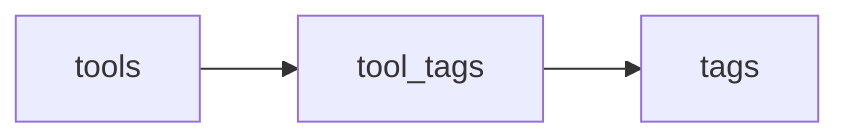
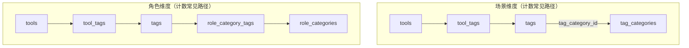

# 工具 · 标签 · 场景分类 · 角色 — 逻辑关系与计数口径

> **文档用途**：把 **工具、标签、场景分类（tag_categories）、角色分类（role_categories）** 四者在库表中的联结方式、**前台/后台数字含义**、以及后台常见操作的语义 **一次性写清**。  
> **菜单产品线分类（`categories`，左侧 `/category`）** 与工具主归属有关，本文 **§7** 仅作对照引用；口径细节以 [`docs/tag-taxonomy-admin-alignment.md`](./tag-taxonomy-admin-alignment.md) 与 [`.cursor/rules/taxonomy-tags-tools-categories.mdc`](../.cursor/rules/taxonomy-tags-tools-categories.mdc) 为准。

---

## ⭐ 重要说明（必读）

1. **工具是否出现在「某场景」的前台聚合里**，只看 **`tool_tags`**：工具是否挂了至少一条 **启用**（`tags.is_disabled = false`）且 **`tags.tag_category_id` 指向该场景** 的标签。**仅改 `tags.tag_category_id` 而不挂 `tool_tags`，工具不会凭空进入该场景列表。**
2. **工具是否计入「某角色」的前台收录**，路径是 **`tool_tags` → `tags`（启用）→ `role_category_tags`（该角色）**。角色侧 **没有** 单独的「工具↔角色」表；**联结表 `role_category_tags` 只表达「角色聚合哪些标签」，不直接挂工具。**
3. **场景 Tab / 首页卡片上的「收录工具数」** 与 **`neonListToolsByTagCategoryId` 等列表** 同源：`COUNT(DISTINCT tools.id)`，且 **禁用词条不参与计数**（见 §3.1）。后台「挂载 / 移除挂载」选人用的 SQL **可能与计数口径不完全一致**（见 §5.2）。
4. **`tags` 表里一行标签是全局唯一的**：修改 **`tags.tag_category_id`**（词条归属场景）会影响 **所有挂载该标签的工具** 在前台场景推导上的表现；这是产品设计层面的「全局词条」，不是「每个工具一份副本」。
5. **单工具最多 20 条 `tool_tags`**（应用层与迁移约束一致）；挂载时合并超限会 **截断或报错**，视接口而定。

---

## 1. 四个核心实体（你在后台最常碰到的）

| 实体 | 表 / 说明 | 一句话 |
|------|-----------|--------|
| **工具** | `tools` | 业务主体；`status`、`is_disabled` 控制是否对外列出。 |
| **标签（词条）** | `tags` | 全局词表；`tag_category_id` 表示 **词条归属哪个场景分类**（可为空）。 |
| **场景分类** | `tag_categories` | 「按场景找 AI」维度；与首页 `/tag-category/[slug]`、后台「场景分类管理」对应。 |
| **角色分类** | `role_categories` | 「按角色」维度；与首页角色条带、`/role/[slug]`、后台「角色分类管理」对应。 |

---

## 2. 关系怎么落在库表里

### 2.1 工具 ↔ 标签（挂载关系的唯一落点）

| 表 | 含义 |
|----|------|
| **`tool_tags`** | **工具挂了哪些标签**，有序：`tool_id`、`tag_id`、`sort_order`。 |

- 前台几乎所有「按标签 / 按场景 / 按角色找工具」的推导，**前提都是**：这条边存在，且工具本身 **已通过、未隐藏**，标签在计数场景下通常还要求 **未禁用**。

### 2.2 标签 ↔ 场景分类（词条归属）

| 字段 / 表 | 含义 |
|-----------|------|
| **`tags.tag_category_id`** | 该词条 **归属于哪个场景分类**（可 `NULL` = 未归入场景库）。 |

### 2.3 标签 ↔ 角色分类（角色聚合哪些词条）

| 表 | 含义 |
|----|------|
| **`role_category_tags`** | **角色 ↔ 标签** 多对多：`(role_category_id, tag_id)`。 |

- 表达的是：**这个角色维度「收纳」哪些标签**；工具要通过 **`tool_tags` 挂上这些标签之一**，才会落入该角色的工具集。

### 2.4 合成视图（从工具到场景 / 角色）

---

## 3. 计数规则（前台收录 vs 后台 Tab）

以下均默认：**工具** `status = 'approved'` 且 **`COALESCE(is_disabled,false)=false`**；**标签**在计数 SQL 里 **`COALESCE(is_disabled,false)=false`**（除非另行说明）。

### 3.1 场景分类：**收录工具数**

**定义**：该场景下，`COUNT(DISTINCT tools.id)`，满足：

- 存在 **`tool_tags`** 连到 **`tags`**；
- **`tags.tag_category_id = 该场景 id`**（且非 NULL）；
- 标签 **启用**；
- 工具 **已通过且未隐藏**。

**代码锚点**：[`neonCountPublicListedToolsByTagCategoriesBulk`](../lib/neon/data.ts)（注释已与首页卡片、`neonListToolsByTagCategoryId` 列表对齐）。

### 3.2 角色分类：**收录工具数**

**定义**：该角色下，`COUNT(DISTINCT tools.id)`，满足：

- **`tool_tags` → `tags`（启用）→ `role_category_tags`** 且 **`role_category_id` 匹配**；
- 工具 **已通过且未隐藏**。

**代码锚点**：[`neonCountPublicListedToolsByRoleCategoriesBulk`](../lib/neon/data.ts)（与 `neonListToolsByRoleCategoryId` 同源）。

### 3.3 后台「场景 / 角色分类管理」Tab 上的 **两个数字**

| 展示 | 含义（口径） |
|------|----------------|
| **加粗「收录」数字** | 与 **§3.1 / §3.2** 一致的前台同款 **去重工具数**。 |
| **「N词」** | **场景**：本场景标签库词条数（通常对应 **`tags.tag_category_id` 指向本场景** 的行数）；**角色**：**`role_category_tags`** 中关联到本品的词条数（后台列表展示口径）。 |

---

## 4. 管理后台常见操作 — 四条线分别改什么

| 页面 / Tab | 写入对象 | 会不会动 `tool_tags` | 备注 |
|-------------|----------|----------------------|------|
| **标签清理**（`/admin/tags`） | `tags` 行（合并、改名、删除、`is_disabled`、`tag_category_id` 等） | 间接：删标签 / 禁用会影响前台展示 | **全局词条**：改场景归属影响所有挂该标签的工具之前台语义。 |
| **场景分类管理 → 关联标签** | **`tags.tag_category_id`**（迁入 / 迁出场景库） | 否 | 管的是 **词条属于哪个场景**，不是给工具打标。 |
| **场景分类管理 → 挂载工具** | **`tool_tags`** | 是 | 按本场景 **启用词条白名单** 合并写入（空则整批按序填充，受 20 枚上限约束）。 |
| **场景分类管理 → 移除挂载** | **`tool_tags`** | 是 | 摘掉 **`tag_category_id = 本场景`** 的词条边；其它标签保留。 |
| **角色分类管理 → 关联标签** | **`role_category_tags`** | 否 | 管角色 **聚合哪些标签**；不直接写工具。 |
| **角色分类管理 → 挂载工具** | **`tool_tags`** | 是 | 按本品 **启用且已联结** 的词条白名单合并写入。 |
| **角色分类管理 → 移除挂载** | **`tool_tags`** | 是 | 摘掉 **出现在本品 `role_category_tags` 中的词条** 边；其它标签保留。 |
| **工具与标签**（`/admin/tools-tagging`） | **`tool_tags`** + 可选 hint 改 **`tags.tag_category_id`** | 是 | 按工具维度维护标签；hint 语义见该页与 [`neonSetToolTagsForTool`](../lib/neon/data.ts)。 |

---

## 5. 易混项与后台 SQL 特例

### 5.1 「关联标签」≠「挂载工具」

- **关联标签（场景）**：只动 **`tags.tag_category_id`** / 场景库归属。  
- **关联标签（角色）**：只动 **`role_category_tags`**。  
- **挂载工具**：写 **`tool_tags`**，工具才会在聚合链路里被命中。

### 5.2 挂载 / 移除挂载 **选人列表** vs **§3 计数**

- **挂载工具**：搜索会 **排除** 「已通过 `tool_tags` 挂上 **任意一条** `tags.tag_category_id = 本场景` 的词条」的工具（**含词条已禁用**，避免重复挂载）。  
- **前台收录计数（§3.1）**：只统计 **启用** 标签。  
→ 可能出现：**后台选人里已隐藏**（禁用词条命中）与 **前台收录数** 直觉不一致，属于 **口径差异**，不是 bug。

- **移除挂载**：列表 **仅展示** 已通过工具且 **至少有一条** 与本维度相关的 `tool_tags`（场景 / 角色 EXISTS 与实现一致）。

### 5.3 移除挂载 **不会** 自动做这些事

- **不会** 删除 `tags` 行；**不会** 改 **`tags.tag_category_id`**；**不会** 删除 **`role_category_tags`**。  
- 仅从 **`tool_tags`** 拆掉与本维度相关的边。

---

## 6. 菜单产品线（categories） — 与本文四者的位置

- **`tools.category_id` / `tool_categories`**：工具在 **左侧产品线 / `/category`** 下的归属（与 **场景 / 角色 / 标签聚合** 正交）。  
- **`category_tags`**：运营上「菜单分类关联哪些标签」，**不负责** 替代 `tool_tags` 收录逻辑。  
- 详见：[`.cursor/rules/taxonomy-tags-tools-categories.mdc`](../.cursor/rules/taxonomy-tags-tools-categories.mdc) §2。

---

## 7. 代码锚点（排查问题时从这里搜）

| 主题 | 入口 |
|------|------|
| 场景收录工具 bulk 计数 | [`neonCountPublicListedToolsByTagCategoriesBulk`](../lib/neon/data.ts) |
| 角色收录工具 bulk 计数 | [`neonCountPublicListedToolsByRoleCategoriesBulk`](../lib/neon/data.ts) |
| 挂载合并逻辑 | [`neonAdminAppendListedToolTags`](../lib/neon/data.ts) |
| 场景剥离 / 角色剥离 | [`neonAdminStripSceneTagsFromListedTool`](../lib/neon/data.ts)、[`neonAdminStripRoleTagsFromListedTool`](../lib/neon/data.ts) |
| 找人搜索（exclude / onlyListed） | [`neonAdminSearchToolsForTagging`](../lib/neon/data.ts)；通用选人单次默认 30、封顶 50。**场景/角色挂载·移除** 固定 **每页最多 50**，带 **`offset`**；每次翻页单独查库；并行 `COUNT(*)` 取 **`total`**。 |
| 详情页场景 chips | [`neonListPublicSceneSummariesForTool`](../lib/neon/data.ts) |

---

## 8. 维护约定

- **计数或 JOIN 口径变更**时：同步更新 **本文 §3 / §5** 与 [`docs/tag-taxonomy-admin-alignment.md`](./tag-taxonomy-admin-alignment.md)、必要时更新 Cursor 规则 [`taxonomy-tags-tools-categories.mdc`](../.cursor/rules/taxonomy-tags-tools-categories.mdc)。  
- **实现与文档冲突**：以 **迁移 + `lib/neon/data.ts` 当前 SQL** 为准，并回头修正文档。
